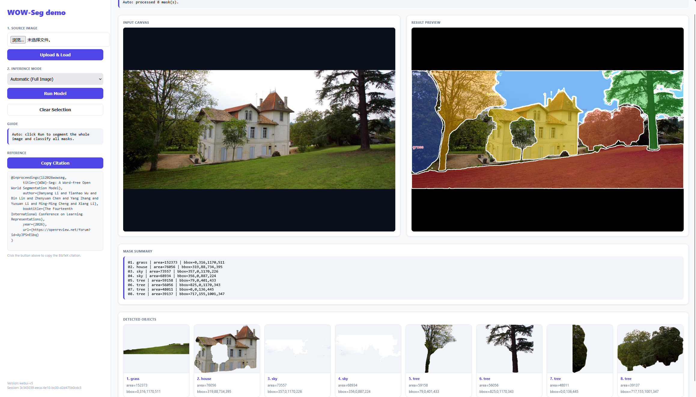
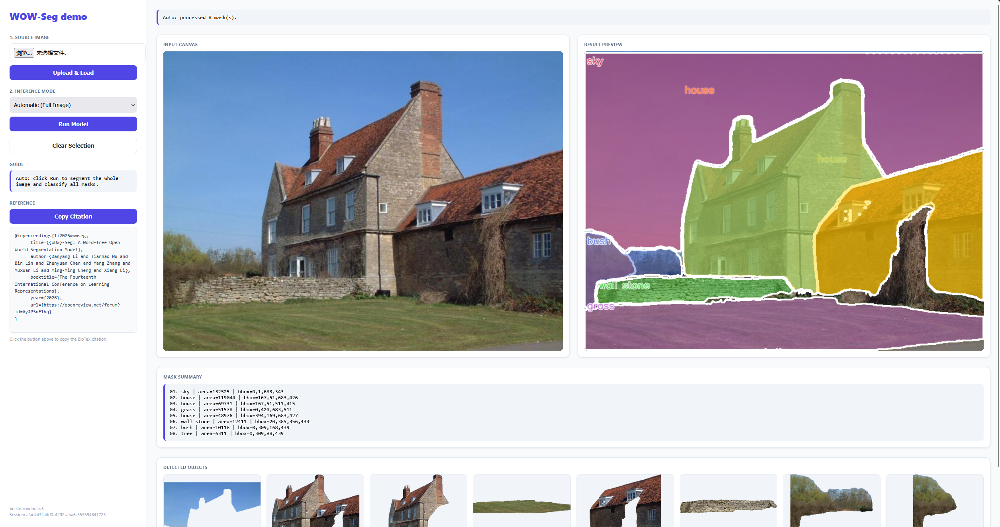
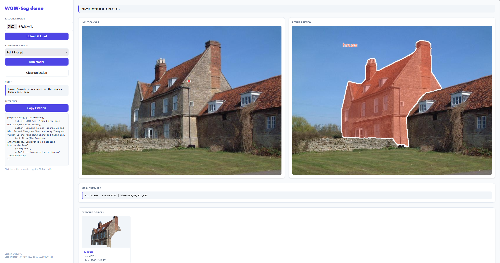
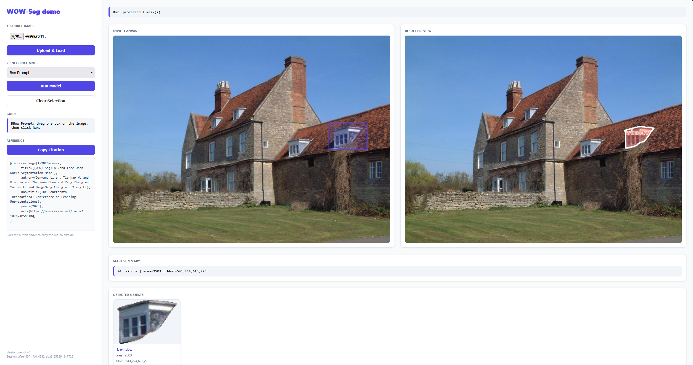

<div align="center">
<h1>
WOW-SEG: A WORD-FREE OPEN WORLD SEGMENTATION MODEL
</h1>

</div>

<div align="center">

[Danyang Li](), [Tianhao Wu](), [Bin Lin](), [Zhenyuan Chen](), [Yang Zhang](), [Yuxuan Li]() <br>
[Ming-Ming Cheng](), [Xiang Li]() <br>
NKU SICAU PKU

</div>

<p align="center">
  <a href="https://openreview.net/forum?id=AyJPSnE1bq"><b>📕 Paper</b></a> |
  <a href="https://huggingface.co/AAwcAA/WOW-Seg"><b>📥 Model Download</b></a> |
  <a href="#dataset"><b>🤗 Dataset</b></a> |
  <a href="#demo"><b>🖥️ Demo</b></a> |
  <a href="#evaluation"><b>🔎 Evaluation</b></a> |
  <a href="#license"><b>📜 License</b></a> |
  <a href="#citation"><b>📖 Citation (BibTeX)</b></a> <br>
</p>

<p align="center">
     <br>
</p>

## News

**2026.01.26**: 🎉 Our new work, WOW-Seg is accepted by ICLR 2026.

**2026.02.28**: 🎉 Model weights and datasets are released. Please refer to [Model](https://huggingface.co/AAwcAA/WOW-Seg) and [Datasets](#dataset).

## Introduction

**WOW-Seg** is a Word-free Open World Segmentation model for segmenting and recognizing objects from open-set categories. Specifically, WOW-Seg introduces a novel visual prompt module, Mask2Token, which transforms image masks into visual tokens and ensures their alignment with the VLLM feature space. Moreover, we introduce the Cascade Attention Mask to decouple information across different instances. This approach mitigates inter-instance interference, leading to a significant improvement in model performance. We further construct an open world region recognition test [**benchmark**](#dataset): the Region Recognition Dataset(RR-7K). With 7,662 classes, it represents the most extensive category-rich region recognition dataset to date. 


<p align="center">
     <br>
</p>

## Installation

1. Clone this repository and navigate to the base folder
```bash
git clone https://github.com/AAwcAA/WOW-Seg-Meta.git
cd WOW-Seg-Meta
```

2. Install packages
```bash
conda create -n wow-seg python=3.9 -y
conda activate wow-seg
pip install -r requirements.txt
```

3. Install Flash-Attention
```bash
pip install flash-attn --no-build-isolation
git clone https://github.com/Dao-AILab/flash-attention.git
cd flash-attention
python setup.py install
```

## Dataset

You can download the RR-7K dataset from the following platforms:

**Hugging Face**: [RR-7K Dataset](https://huggingface.co/datasets/AAwcAA/RR-7K) 

**ModelScope**: [RR-7K Dataset](https://www.modelscope.cn/datasets/AAwcAA/RR-7K) 

## Demo

Interactive demo scripts live in **`demo/`**. Full setup steps, checkpoint paths, and launch commands are in **[`demo/README.md`](demo/README.md)**.

The demo currently supports:

- `Auto`
- `Point Prompt`
- `BBox Prompt`

<p align="center">
     <br>
</p>

<table align="center">
  <tr>
    <td align="center"></td>
    <td align="center"></td>
    <td align="center"></td>
  </tr>
  <tr>
    <td align="center"><b>Auto</b></td>
    <td align="center"><b>Point Prompt</b></td>
    <td align="center"><b>BBox Prompt</b></td>
  </tr>
</table>

## Evaluation

Scripts for **open-vocabulary classification on region masks** live in **`wow_eval/`**: convert Osprey-style annotations to InternVL JSONL, then run mask-conditioned inference. Full steps, path placeholders, and file overview are in **[`wow_eval/README.md`](wow_eval/README.md)**.

**Prerequisites** (see the table in `wow_eval/README.md` for details):

| Item | Notes |
|------|--------|
| COCO images | Root folder used as `--image_root` (e.g. `train2017/`, `val2017/`). |
| Osprey eval JSON | From [Osprey](https://github.com/CircleRadon/Osprey); convert with `convert_osprey_to_internvl.py`. |
| WOW-Seg checkpoint | e.g. [AAwcAA/WOW-Seg](https://huggingface.co/AAwcAA/WOW-Seg) → `--model_path`. |
| SentenceBERT | e.g. [all-MiniLM-L6-v2](https://huggingface.co/sentence-transformers/all-MiniLM-L6-v2) → `--bert_path`. |

**Workflow** (always `cd wow_eval` first):

1. Edit `COCO_ROOT_DIR` and `BATCH_TASKS` in `convert_osprey_to_internvl.py`, then run:
   ```bash
   cd wow_eval
   python convert_osprey_to_internvl.py
   ```
2. Run inference (placeholders — replace with your paths):
   ```bash
   python single_mask_infer.py \
     --dataset_path path/to/osprey2internvl_xxx.jsonl \
     --image_root path/to/coco \
     --model_path path/to/wow-seg-internvl \
     --bert_path path/to/all-MiniLM-L6-v2 \
     --output_path path/to/results \
     --subset_num 1 \
     --subset_idx 0
   ```
3. For multi-GPU sharding, use `--subset_num` / `--subset_idx` or the example launcher **`single_mask_infer.sh`** (set variables at the top of the script).

Core files: `convert_osprey_to_internvl.py`, `single_mask_infer.py`, `single_mask_infer.sh`, and `internvl/` (model code).


## License

This code repository is licensed under [Apache 2.0](./LICENSE).

## Acknowledgement
We would like to thank the following projects for their contributions to this work:

- [SAM](https://github.com/facebookresearch/segment-anything)
- [SAM 2](https://github.com/facebookresearch/sam2)

## Citation

If you find WOW-Seg useful for your research and applications, or use our dataset in your research, please use the following BibTeX entry.

```bibtex
@inproceedings{li2026wowseg,
      title={{WOW}-Seg: A Word-free Open World Segmentation Model},
      author={Danyang Li and Tianhao Wu and Bin Lin and Zhenyuan Chen and Yang Zhang and Yuxuan Li and Ming-Ming Cheng and Xiang Li},
      booktitle={The Fourteenth International Conference on Learning Representations},
      year={2026},
      url={https://openreview.net/forum?id=AyJPSnE1bq}
}
```
